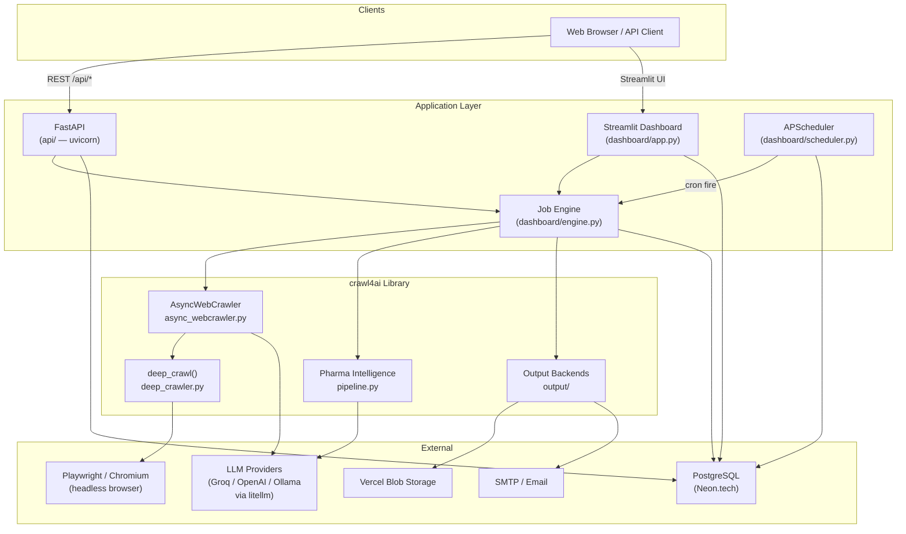
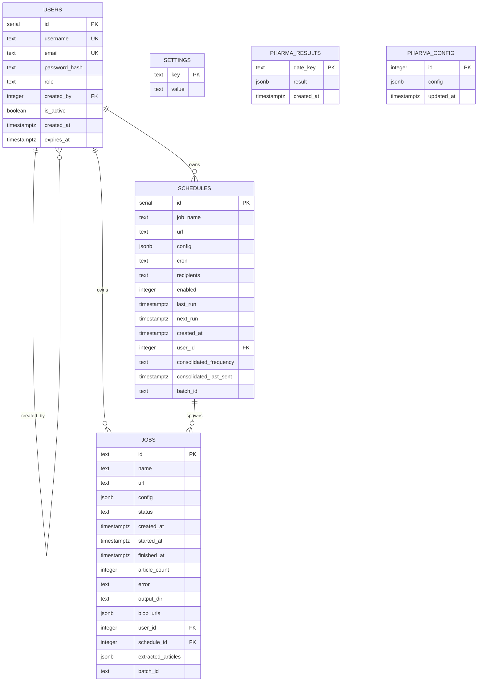
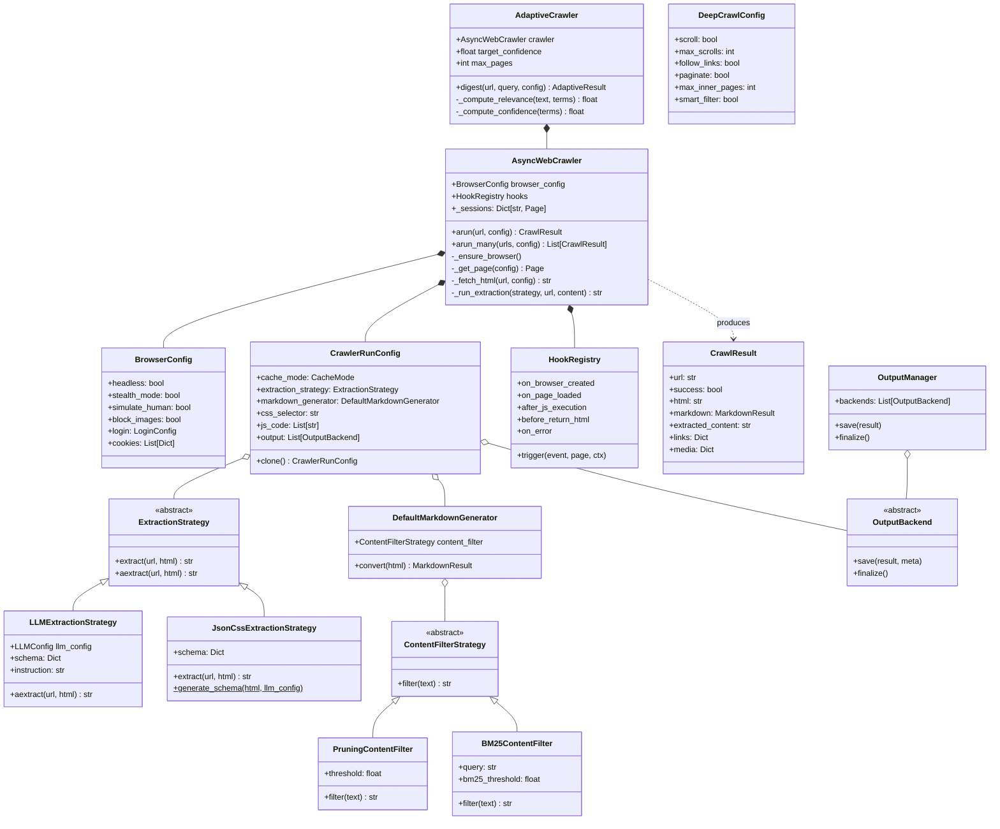
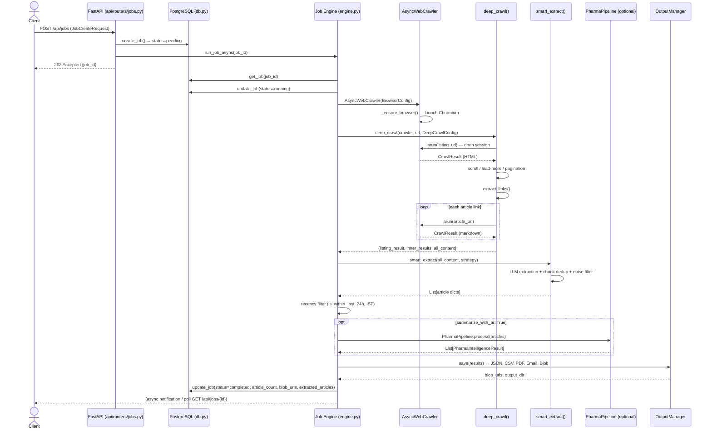

# Crawl4AI Architecture

Six Mermaid diagrams that cover the essential architecture of the project.

---

## 1. System Context

Who/what is involved, how the pieces are deployed, and how they connect at a high level.

---

## 2. Database Entity-Relationship

All PostgreSQL tables, columns, and foreign-key relationships.

---

## 3. Core Crawler Class Model

The key classes in the `crawl4ai/` library, their composition, and the strategy/plugin hierarchy.

---

## 4. Deep Crawl Phase Flow

The 8 phases of `deep_crawl()` in `crawl4ai/deep_crawler.py`.

```mermaid
flowchart TD
    START([Start: deep_crawl\ncrawler, url, deep_config, run_conf])

    P1["Phase 1\nCrawl listing page\n(open session)"]
    P2{scroll=True?}
    P3["Phase 2\nscroll_to_bottom()\nmax_scrolls times"]
    P4{click_load_more?}
    P5["Phase 3\nclick_load_more()\nmax_load_more_clicks"]
    P6["Phase 4\nRe-capture HTML\nafter scrolling"]
    P7["Phase 5\nextract_links()\nfilter + deduplicate"]
    P8{paginate=True?}
    P9["Pagination loop\nclick_next_page() → extract_links()\nup to max_pages"]
    P10{use_screenshots?}
    P11["Phase 6\ntake_full_screenshot(page)"]
    P12["Close listing session"]
    P13["Phase 7\nCrawl inner pages\n(concurrent, max_inner_pages)"]
    P14{smart_filter=True?}
    P15["smart_extract()\nLLM noise filter + chunk dedup"]
    P16["Phase 8\nAggregate\nlisting + inner page content"]
    END([Return: listing_result, inner_results,\nall_content, screenshots, article_links])

    START --> P1 --> P2
    P2 -->|Yes| P3 --> P4
    P2 -->|No| P4
    P4 -->|Yes| P5 --> P6
    P4 -->|No| P6
    P6 --> P7 --> P8
    P8 -->|Yes| P9 --> P10
    P8 -->|No| P10
    P10 -->|Yes| P11 --> P12
    P10 -->|No| P12
    P12 --> P13 --> P14
    P14 -->|Yes| P15 --> P16
    P14 -->|No| P16
    P16 --> END
```

---

## 5. Pharma Intelligence Pipeline

End-to-end data flow through `PharmaPipeline.process()` in `crawl4ai/pharma_intelligence/pipeline.py`.

```mermaid
flowchart TD
    IN(["Input\nList[PharmaArticle]\n(title, text, url, source, published_at)"])

    S1["Stage 1 — Entity Extraction\nextraction.py · EntityExtractor\nMolecule, company, trial_phase,\nregulatory_body, event_type …"]
    LLM1{LLM\navailable?}
    FB1["Fallback: regex rules"]

    S2["Stage 2 — Classification\nclassifier.py · ArticleClassifier\ncategories[], primary_category, therapy_area"]
    LLM2{LLM\navailable?}
    FB2["Fallback: regex patterns"]

    S3["Stage 3 — Exclusion Filter\nfilter.py · ExclusionFilter\nshould_demote + reason"]
    SI{Strong include\nsignal?}
    HE{Hard exclude\npattern?}
    LLM3["LLM decision\n(confidence ≥ 0.65)"]

    S4["Stage 4 — Relevance Scoring\nscorer.py · RelevanceScorer\ntotal_score 0-100, breakdown, is_key_highlight"]

    S5{"Stage 5 — Scope filter / demotion\nout-of-scope? OR score < min_threshold?"}
    DEMOTE["out-of-scope → excluded=True (dropped)\nin-scope low-value → demoted=True (kept, ranked lower)"]
    KEEP["Promote as\nKey Highlight or Regular"]

    S6["Stage 6 — Deduplication\ndeduplicator.py · Deduplicator\nJaccard ≥ 0.55 OR entity fingerprint match\n→ merge to richest cluster"]

    S7["Stage 7 — Summarization\nsummarizer.py · LeadershipSummarizer\nsummary, headline, key_metric, key_points"]
    LLM7{LLM\navailable?}
    FB7["Fallback: sentence extraction"]

    S8["Stage 8 — Sort & Format\nKey Highlights first, then by score\nformatter.py → HTML email or JSON"]

    OUT(["Output\nList[PharmaIntelligenceResult]"])

    IN --> S1
    S1 --> LLM1 -->|Yes| S2
    LLM1 -->|No| FB1 --> S2
    S2 --> LLM2 -->|Yes| S3
    LLM2 -->|No| FB2 --> S3
    S3 --> SI -->|Yes, skip filter| S4
    SI -->|No| HE -->|Yes| S4
    HE -->|No| LLM3 --> S4
    S4 --> S5
    S5 -->|Yes| DEMOTE --> S6
    S5 -->|No| KEEP --> S6
    S6 --> S7
    S7 --> LLM7 -->|Yes| S8
    LLM7 -->|No| FB7 --> S8
    S8 --> OUT
```

---

## 6. Job Execution Sequence

End-to-end flow from a job creation request through to stored results, spanning the API, job engine, crawler, and pharma pipeline.

